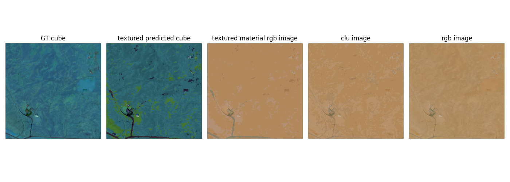
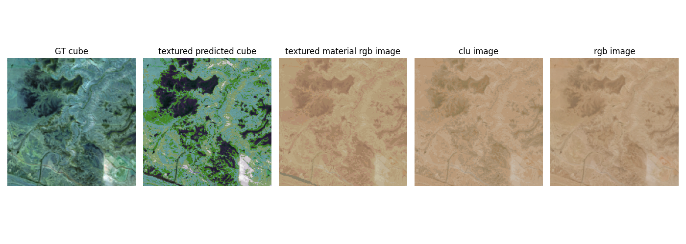
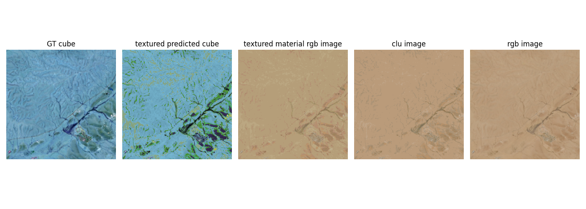
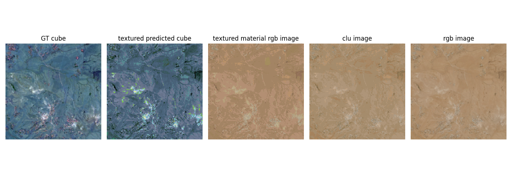
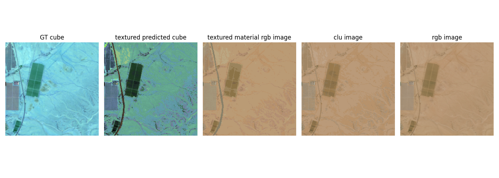
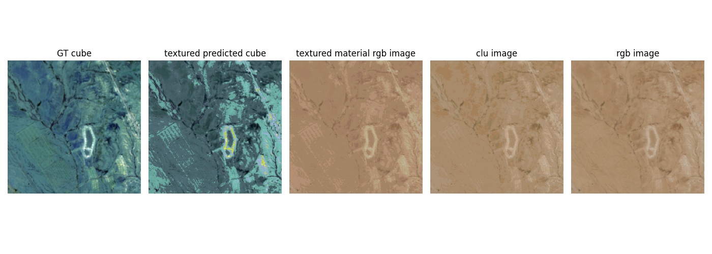

# RGB2MultiSpectral

# 🌍 Hyperspectral Image Cube Generation Pipeline - Hybrid Multispectral Reconstruction (HMR)
HMR full & official Git repo for paper: link to paper.

## 🖼️ Output Examples

The pipeline produces several types of outputs across its stages:

- **Max score pipeline**:  
  
  
  

- **Raffle score pipeline**:  
  
  
  

📌 Note: These are only samples. Full visual and quantitative outputs are available after running the full pipeline or contacting the author for access to complete datasets.

## 🔗 Data Access & Requirements

1. **Download Input Data**  
   Please add the shared Drive directory (containing all required input data such as materials and satellite images) into the root folder of the pipeline.

2. **Drive Link**  
   [📁 Google Drive Folder – Full Pipeline Data](https://drive.google.com/drive/folders/1UkzIlgpd1S2eq6uj-W6LJEsrJJDIuGLh?usp=sharing)  
   *Note: This link will expire after one year. If access is needed after that, please contact the paper's author.*

---

## 📁 Folder Structure & Descriptions

### `results/sentilent_data/patches_anno/`
Contains examples of cropped frames and their corresponding annotations. This includes:
- Input satellite images
- JSON annotation files
- Output masks derived from the annotations  

📌 Use these files to test several functions in the `DataGenerator_dev` module.

---

### `results/sentilent_data/patches_after_anno/`
Augmented samples generated after annotating the cropped Sentinel-2 data.

---

### `results/sentilent_data/metrics/`
Includes evaluation metrics for clustering RGB values across all segments of the dataset.

---

### `results/sentilent_data/full_dataset/`
Due to limited Drive storage, only test input data is included.  
To obtain the full dataset (train/val/test):
1. Contact the author  
2. Use the `DataGenerator_dev` class along with the data in `results/sentilent_data/full_data/` to regenerate the complete dataset locally.

---

### `results/cubes_generator/Max_score/` and `results/cubes_generator/raffle_score/`
These folders contain:
- Examples of pipeline results
- Associated evaluation metrics (based on 1,000 samples)

📌 To get full results:
- Run the pipeline on `results/sentilent_data/full_dataset/test/`, or  
- Contact the author to access the complete output set.

---

## ⚙️ Pipeline Usage Guidelines

- Follow the intended execution order of functions in each module/package to ensure the pipeline runs correctly.
- In the `back/` package, there's no need to re-train the semantic segmentation model unless working with new data.
- Use the `DataGenerator` class to inject your own dataset for:
  - Training a new model
  - Testing on unseen data
- The `HVI-CIDNet` NN were inferenced using the `generalization.pth` file. These should be applied to the `train/val/test` folders inside `results/sentilent_data/full_dataset/`.
- ```bibtex
  @article{yan2025hvi,
  title={HVI: A New color space for Low-light Image Enhancement},
  author={Yan, Qingsen and Feng, Yixu and Zhang, Cheng and Pang, Guansong and Shi, Kangbiao and Wu, Peng and Dong, Wei and Sun, Jinqiu and Zhang, Yanning},
  journal={arXiv preprint arXiv:2502.20272},
  year={2025}}
- `VGG19` by `Pytorch` was used for image segmentation to material classes - with own finetune phase.
- ```bibtex
  @article{paszke2019pytorch,
  title={Pytorch: An imperative style, high-performance deep learning library},
  author={Paszke, A},
  journal={arXiv preprint arXiv:1912.01703},
  year={2019}}
---

## 🚀 Recommendation

To achieve the best performance, apply HVI-CIDNet directly on your own input data using the full process described above.

---

## 📄 Citation

If you use this project in your research or publication, please cite the following:

```bibtex
   my own paper citation

